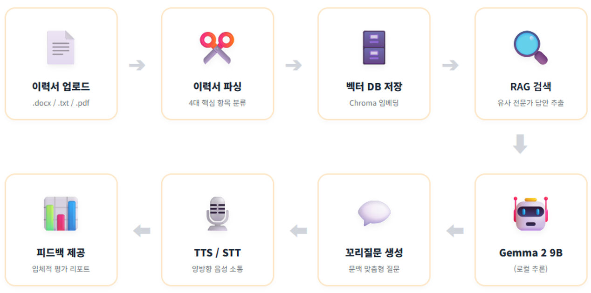

# 면접 꼬리질문 챗봇 개발
- 기간 : 2026.06.08 ~ 2026.06.26
- 인원 : 5명
- 역할 : AI 모델 및 데이터 처리, TTS/STT 기능 구현, RAG 시스템 구축
- 기술 : `Python` `Streamlit` `Gemma2 9b` `Ollama` `Langchain` `Chroma` `HuggingFace` `TTS` `STT` `MariaDB` `FastAPI` `Python-docx` `git` `Github`
- 설명 : 지원자의 이력서 맞춤형 질문과 실시간 피드백을 제공하는 대화형 면접 연습 서비스

## 프로젝트 개요
최근 기업의 면접 트렌드가 지원자의 역량과 사고 과정을 심층 검증하는 꼬리질문 중심으로 변화함에 따라 취업 준비생들의 실전 연습 환경 부족에 대한 어려움이 심화되고 있습니다. 
본 프로젝트에서는 사용자가 업로드한 이력서 및 자기소개서 데이터를 활용해 직무 맞춤형 실시간 꼬리질문을 생성하는 생성형 AI 기반 대화형 면접 연습 서비스를 제공합니다. 
이를 통해 취업 준비생이 언제 어디서나 실전과 유사한 환경에서 면접을 반복 학습하고 실시간 피드백 리포트를 받아보며 실전 대응력을 극대화하는 것을 목표로 합니다.

## 프로젝트 목표
- **실시간 맥락 인식형 대화 시스템 구축:** Gemma 2 9B 모델과 LangChain 프레임워크를 활용하여, 대화 맥락을 유기적으로 파악하고 답변 키워드 기반의 후속 꼬리 질문을 실시간으로 생성하는 대화형 엔진 구조 설계
- **체계적인 데이터 및 이력서 정보 관리:** 사용자의 회원 정보, 업로드한 문서 데이터, 실시간 질문/답변 이력 데이터를 체계적으로 설계하고 관리하는 MariaDB 관계형 데이터베이스 모델링 및 구조화 수행
- **사용자 맞춤형 면접 웹 서비스 구현:** FastAPI 백엔드 엔진과 Streamlit 인터페이스를 연동하여 STT/TTS 기술 기반의 실시간 양방향 음성 면접 환경을 구현하고, 면접 종료 후 종합 점수와 강/약점 분석 결과를 제시하는 피드백 리포트 시스템 구축

## 데이터 출처
AI-Hub의 면접 데이터셋에서 프로젝트에 주어진 제한된 시간과 컴퓨터 자원을 고려해 텍스트 중심의 JSON 형식 데이터만 일부 선별하였고, 
정리된 데이터는 LangChain 기반 대화 시스템이 사용자의 자기소개서를 정확하게 이해하고 실시간으로 날카로운 꼬리질문을 던질 수 있는 핵심 지식 데이터로 활용.

## 설계 및 구현

## 구현 영상
- 📹 [바로가기]()

## 한계 및 보완점
- **추론 지연 개선:** 로컬 LLM 서빙 시 발생하는 피드백 생성 지연을 모델 양자화 및 추론 최적화를 통해 해결 예정
- **음성 인식 고도화:** 주변 소음 및 마이크 품질에 따른 STT 인식률 저하 문제를 오디오 전처리 기술 적용으로 개선
- **데이터 커버리지 확대:** 특정 직군 편향 해소를 위해 추가 면접 데이터 수집 및 증강 파이프라인 연동 계획
- **질문 논리성 강화:** 답변의 핵심 키워드 및 논리 구조 추적 알고리즘을 고도화하여 꼬리질문의 문맥적 완성도 향상
- **UI/UX 및 기능 확장:** 사용자 피드백 기반 UI 개선 및 면접 성장 추이 시각화 대시보드 등 서비스 완성도 제고

## 결론
- **심리적 부담 경감:** 맞춤형 꼬리질문 대응 훈련을 통해 실전 면접에 대한 막연한 불안감을 해소하고 자신감을 향상시킴
- **접근성 향상:** 시간과 공간, 비용 제약 없는 상시 면접 연습 환경을 제공하여 취업 준비의 효율성 극대화
- **실전 대응력 강화:** 개인화된 AI 피드백을 통해 부족한 면접 역량을 즉각 보완하고 실전 직무 대응력을 강화함
- **서비스 확장성:** 범용적인 면접 인터뷰 데이터셋을 활용하여 향후 다양한 직군 및 산업 분야로의 적용 가능성을 확보함
